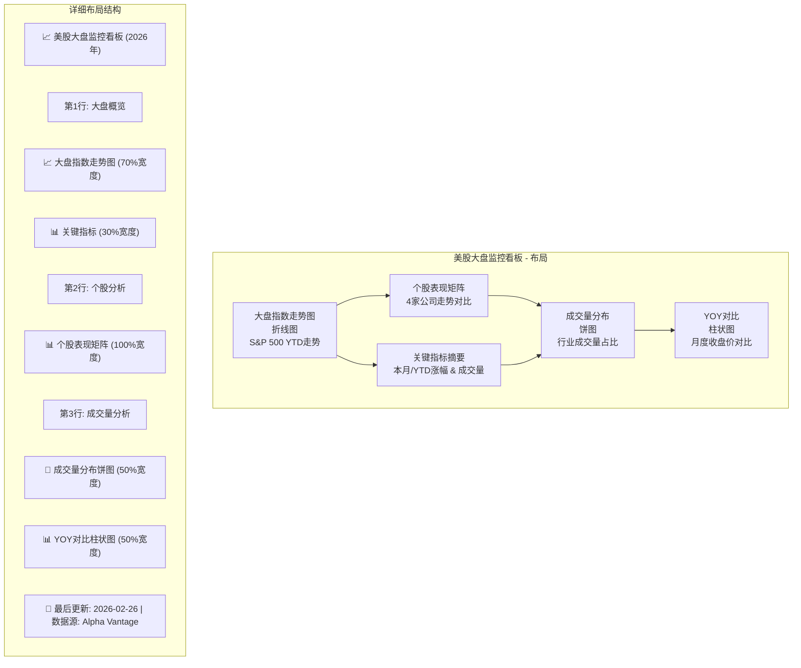
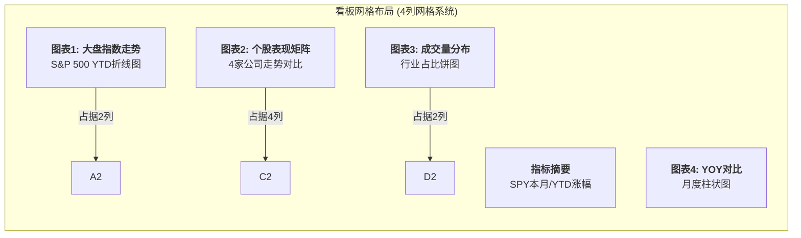
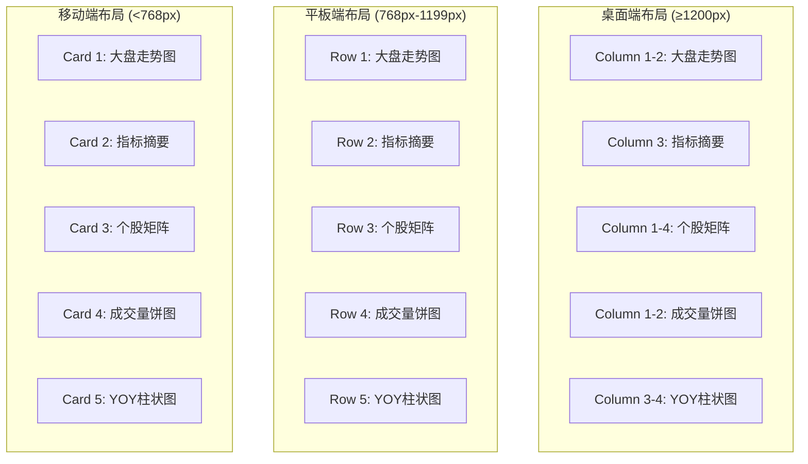

# 美股大盘监控看板 - 布局设计

## 📊 看板布局草图 (Mermaid)



## 🎨 实际看板网格布局



## 📱 响应式布局设计



## 🛠️ 技术实现建议

### 布局实现方式
1. **CSS Grid系统** (推荐)
   ```css
   .dashboard-grid {
     display: grid;
     grid-template-columns: repeat(4, 1fr);
     grid-gap: 20px;
     padding: 20px;
   }

   .chart-large { grid-column: span 2; }
   .chart-full { grid-column: span 4; }
   ```

2. **Bootstrap网格** (备选)
   ```html
   <div class="row">
     <div class="col-md-8">大盘走势图</div>
     <div class="col-md-4">指标摘要</div>
   </div>
   ```

3. **Flexbox布局** (简单实现)
   ```css
   .dashboard-container {
     display: flex;
     flex-wrap: wrap;
     justify-content: space-between;
   }
   ```

### 图表库选择
- **主要推荐**: ECharts、Chart.js、Plotly.js
- **企业级**: Highcharts、D3.js (定制化强)
- **轻量级**: ApexCharts、Frappe Charts

### 交互功能
1. **悬停提示**: 显示具体数值
2. **点击钻取**: 从大盘到个股详情
3. **时间筛选**: 切换YTD/MTD/自定义范围
4. **数据导出**: CSV/PNG导出功能

---
*布局设计完成，接下来为每个图表定义详细配置*