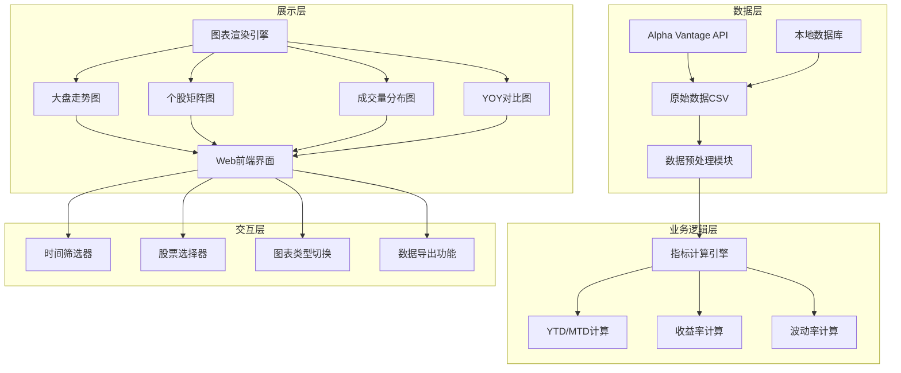
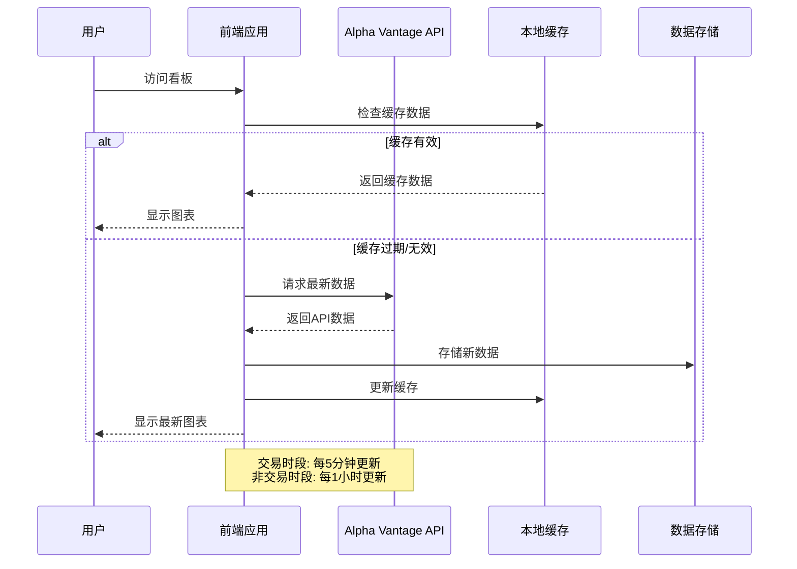

# 美股大盘监控看板 - 产品说明文档

## 📋 文档概览

| 项目 | 内容 |
|------|------|
| **文档版本** | v1.0 |
| **创建日期** | 2026-02-27 |
| **目标用户** | 投资团队、基金经理、风险控制人员 |
| **数据来源** | Alpha Vantage API (现有数据集) |
| **更新频率** | 交易日收盘后更新 |
| **看板状态** | 设计阶段，待开发 |

## 🎯 业务目标与价值

### 核心业务需求
1. **实时监控**：跟踪S&P 500及重点个股的每日表现
2. **相对分析**：评估个股相对于大盘的超额收益(Alpha)
3. **风险识别**：通过波动率和成交量异常发现潜在风险
4. **决策支持**：为调仓、对冲、资产配置提供数据支持

### 目标用户画像
| 角色 | 使用场景 | 关键需求 |
|------|----------|----------|
| **基金经理** | 每日晨会、投资决策 | 大盘趋势、个股相对表现、行业资金流向 |
| **风险控制** | 风险监控、压力测试 | 波动率异常、最大回撤、VaR计算 |
| **研究分析师** | 公司研究、行业分析 | 历史表现对比、技术指标、量价关系 |
| **投资顾问** | 客户报告、投资建议 | 可视化图表、简明摘要、趋势说明 |

## 🏗️ 看板架构设计

### 系统架构图


### 技术栈建议
| 组件 | 推荐技术 | 备选方案 | 说明 |
|------|----------|----------|------|
| **前端框架** | React + TypeScript | Vue.js | 组件化开发，类型安全 |
| **图表库** | ECharts / Chart.js | Highcharts | 丰富的金融图表类型 |
| **数据处理** | Pandas (Python) | D3.js | 复杂指标计算 |
| **数据存储** | CSV文件 + 内存缓存 | SQLite | 简单轻量，无需数据库 |
| **部署方式** | 静态网页 + GitHub Pages | Docker容器 | 低成本部署 |

## 📊 看板组件详细说明

### 组件1: 大盘指数走势图
**位置**: 看板左上区域 (占据2列宽度)
**优先级**: P0 (必需)

#### 业务功能
- 监控S&P 500指数的YTD走势
- 识别关键支撑/阻力位
- 观察市场整体趋势方向

#### 交互设计
- **悬停显示**: 日期、收盘价、日涨跌幅、成交量
- **点击交互**: 双击重置视图，单击显示详细数据
- **缩放功能**: 鼠标滚轮缩放时间范围
- **时间旅行**: 拖动时间轴查看历史走势

#### 技术规格
- **数据更新**: 每5分钟刷新一次(交易时段)
- **性能要求**: 加载时间 < 2秒
- **数据点**: 最多显示252个交易日(1年)

### 组件2: 关键指标摘要
**位置**: 看板右上区域 (占据1列宽度)
**优先级**: P0 (必需)

#### 显示指标
| 指标 | 计算公式 | 预警阈值 |
|------|----------|----------|
| SPY本月涨幅 | (当前价 - 月初价)/月初价 | ±5% (黄色预警) |
| SPY YTD涨幅 | (当前价 - 年初价)/年初价 | ±10% (红色预警) |
| 当日涨跌幅 | (收盘 - 开盘)/开盘 | ±2% (关注) |
| 20日波动率 | 日收益率年化标准差 | >15% (高风险) |
| 成交量比率 | 当日量/20日均量 | >2.0 (异常) |

#### 视觉设计
- **颜色编码**: 绿色(上涨)、红色(下跌)、灰色(平盘)
- **图标系统**: 📈(上涨)、📉(下跌)、⚠️(预警)
- **动画效果**: 数值变化时轻微脉冲动画

### 组件3: 个股表现矩阵
**位置**: 看板中部 (占据4列宽度)
**优先级**: P0 (必需)

#### 矩阵设计
```
公司   本月涨幅  YTD涨幅  相对SPY  波动率  成交量
NVDA   +8.5%   +15.2%   +5.3%    高     1.2B
AAPL   +3.2%   +12.8%   +2.9%    中     490M
CRM    -1.5%   +8.7%    -1.8%    高     98M
IBM    +2.1%   +10.3%   +1.6%    低     54M
```

#### 交互功能
1. **排序功能**: 点击表头按任意指标排序
2. **筛选功能**: 按行业、市值、波动率等级筛选
3. **钻取功能**: 点击公司名称查看个股详情页
4. **对比模式**: 选择2-4家公司进行详细对比

### 组件4: 成交量分布图
**位置**: 看板左下区域 (占据2列宽度)
**优先级**: P1 (重要)

#### 业务洞察
- **资金流向**: 识别资金集中流入的行业/个股
- **市场关注度**: 高成交量反映市场关注程度
- **异常检测**: 成交量突增可能预示重大事件

#### 图表变体
1. **基础饼图**: 简单占比展示
2. **旭日图**: 行业→个股两级结构
3. **树状图**: 面积表示成交量，颜色表示涨跌幅

#### 数据刷新策略
- **实时**: 交易时段每15分钟更新
- **盘后**: 收盘后更新完整数据
- **历史**: 保留30天历史分布，支持对比

### 组件5: YOY对比图
**位置**: 看板右下区域 (占据2列宽度)
**优先级**: P2 (增强)

#### 对比维度
1. **绝对价格**: 月度平均收盘价对比
2. **收益率**: 月度涨跌幅对比
3. **波动率**: 月度波动率对比
4. **成交量**: 月度平均成交量对比

#### 数据备注
*注: 当前数据集时间范围有限(2025-10至2026-02)，完整YOY对比需等待数据积累*

#### 扩展功能
- **滚动YOY**: 对比最近12个月vs前12个月
- **季度对比**: 按季度聚合数据
- **自定义对比**: 用户选择任意两个时期对比

## 🎨 视觉设计规范

### 颜色方案
| 用途 | 主色 | 辅色 | 说明 |
|------|------|------|------|
| 大盘指数 | #1f77b4 (蓝色) | #aec7e8 | 标准金融蓝色 |
| 上涨 | #2ca02c (绿色) | #98df8a | 表示正收益 |
| 下跌 | #d62728 (红色) | #ff9896 | 表示负收益 |
| 中性 | #7f7f7f (灰色) | #c7c7c7 | 平盘或基准 |
| 预警 | #ff7f0e (橙色) | #ffbb78 | 阈值预警 |

### 字体系统
- **主要字体**: 'Segoe UI', 'Helvetica Neue', Arial, sans-serif
- **数字字体**: 'Roboto Mono', 'Courier New', monospace (等宽)
- **字号规范**:
  - 图表标题: 16px
  - 轴标签: 12px
  - 数据标签: 11px
  - 工具提示: 13px

### 响应式断点
| 设备类型 | 屏幕宽度 | 布局策略 |
|----------|----------|----------|
| 桌面端 | ≥1200px | 4列网格，完整功能 |
| 平板端 | 768px-1199px | 2列网格，简化交互 |
| 移动端 | <768px | 单列堆叠，触屏优化 |

## 🔄 数据流程与更新机制

### 数据更新流程图


### 数据质量保障
1. **完整性检查**: 每日验证数据完整性，缺失时自动重试
2. **异常检测**: 价格跳跃超过20%时标记异常，人工复核
3. **数据备份**: 保留30天历史数据，支持回滚
4. **监控告警**: API失败率>5%时发送告警通知

## 🚀 实施路线图

### 阶段1: MVP (最小可行产品) - 2周
| 任务 | 负责人 | 完成标准 |
|------|--------|----------|
| 数据接口开发 | 后端工程师 | API数据获取和预处理 |
| 大盘走势图实现 | 前端工程师 | 折线图显示YTD数据 |
| 关键指标计算 | 数据工程师 | 准确计算YTD/MTD涨幅 |
| 基础布局搭建 | UI设计师 | 响应式网格布局 |

### 阶段2: 功能增强 - 2周
| 任务 | 负责人 | 完成标准 |
|------|--------|----------|
| 个股矩阵实现 | 前端工程师 | 4家公司对比显示 |
| 成交量分布图 | 数据可视化工程师 | 环形图/饼图切换 |
| 交互功能开发 | 交互设计师 | 筛选、排序、钻取 |
| 移动端适配 | 前端工程师 | 3个断点响应式 |

### 阶段3: 优化部署 - 1周
| 任务 | 负责人 | 完成标准 |
|------|--------|----------|
| 性能优化 | 前端工程师 | 加载时间<2秒 |
| 错误处理 | 全栈工程师 | 优雅降级和用户提示 |
| 部署上线 | DevOps工程师 | GitHub Pages部署 |
| 用户培训 | 产品经理 | 团队培训文档 |

## 📈 成功度量指标

### 业务指标
1. **使用率**: 目标团队每日使用率 > 80%
2. **决策支持**: 用户反馈看板帮助决策的比例 > 70%
3. **效率提升**: 数据查找时间减少 > 50%

### 技术指标
1. **性能**: 页面加载时间 < 2秒
2. **可用性**: 系统可用性 > 99.5%
3. **数据新鲜度**: 数据延迟 < 5分钟(交易时段)

### 用户体验指标
1. **满意度**: NPS (净推荐值) > 40
2. **易用性**: SUS (系统可用性量表) > 75
3. **错误率**: 用户操作错误率 < 2%

## 🔧 维护与支持

### 日常维护
1. **数据监控**: 每日检查数据更新状态
2. **性能监控**: 监控页面加载时间和API响应时间
3. **错误日志**: 收集和分析前端错误日志

### 用户支持
1. **帮助文档**: 在线使用指南和视频教程
2. **反馈渠道**: 用户反馈表单和定期调研
3. **培训材料**: 新员工培训PPT和实操练习

### 迭代计划
1. **每月小版本**: bug修复和性能优化
2. **每季度中版本**: 新功能增加和UI改进
3. **每年大版本**: 架构升级和重大功能重构

---

## 📝 附录

### 附录A: 数据字段说明
| 字段名 | 类型 | 说明 | 示例 |
|--------|------|------|------|
| symbol | string | 股票代码 | "SPY", "AAPL" |
| date | date | 交易日日期 | "2026-02-26" |
| open | float | 开盘价 | 693.28 |
| high | float | 最高价 | 693.30 |
| low | float | 最低价 | 684.35 |
| close | float | 收盘价 | 689.30 |
| volume | integer | 成交量 | 71670990 |

### 附录B: 计算公式汇总
| 指标 | 公式 | Python实现 |
|------|------|------------|
| 日收益率 | (close_t - close_{t-1}) / close_{t-1} | `df['close'].pct_change()` |
| YTD涨幅 | (当前close - 年初第一个close) / 年初第一个close | `(df['close'].iloc[-1] - df[df['date'].dt.year==2026]['close'].iloc[0]) / ...` |
| 波动率(年化) | std(日收益率) × √252 | `df['daily_return'].std() * np.sqrt(252)` |
| 成交量比率 | volume_t / mean(volume_{t-20:t-1}) | `df['volume'] / df['volume'].rolling(20).mean()` |

### 附录C: 相关资源
1. **设计稿**: Figma设计文件链接
2. **API文档**: Alpha Vantage API文档
3. **代码仓库**: GitHub项目地址
4. **测试数据**: 样本数据集下载链接

---

**文档版本**: v1.0
**最后更新**: 2026-02-27
**文档状态**: ✅ 已完成
**下一步**: 团队评审会议 (计划日期: 2026-02-28)